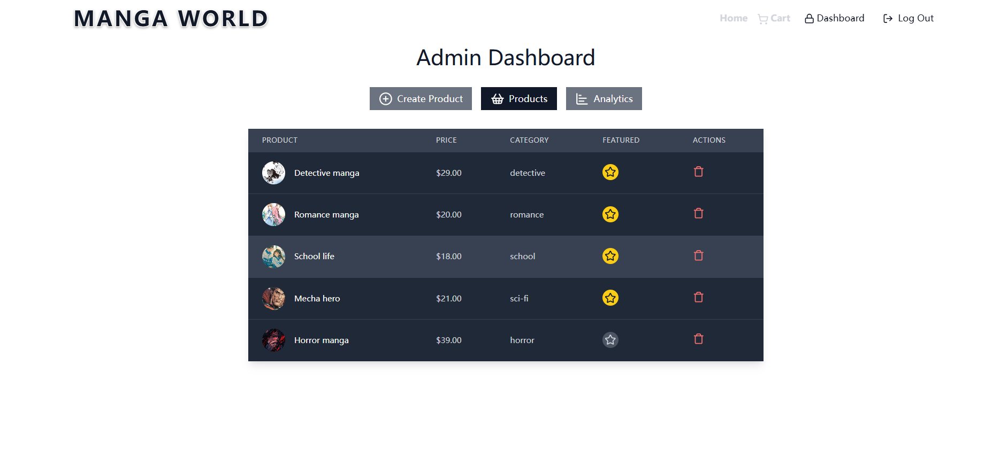

# **Manga World**

A full-stack **MERN marketplace** for buying and selling manga. This project includes secure authentication, role-based authorization, Stripe payment integration, and a responsive frontend with modern state management. Backend and frontend are deployed separately.

## **Table of Contents**

- [Features](#features)
  - [Authentication and Authorization](#authentication-and-authorization)
  - [Marketplace Features](#marketplace-features)
  - [Frontend](#frontend)
  - [Backend](#backend)
  - [Deployment](#deployment)
- [Tech Stack](#tech-stack)
- [Project Structure](#project-structure)
- [Environment Variables](#environment-variables)
- [Running Locally](#running-locally)
- [API Overview](#api-overview-example-endpoints)
- [Deployment](#deployment-1)
- [UI Page](#UI-Pages)

---

## **Features**

### **Authentication and Authorization**

- **JWT-based authentication** with Access Token + Redis-backed Refresh Token
- **Role-Based Access Control (RBAC)** — Admin / User
- **Automatic token renewal** for persistent user sessions

### **Marketplace Features**

- **CRUD operations** for manga products and user registration
- Shopping cart, checkout flow, and order management
- Selling data visualization
- **Stripe integration** for payments (simulated transaction volume > **$5,000**)

### **Frontend**

- Built with **React**, **Vite**, and **Tailwind CSS**
- Global state managed using **Zustand**
- Fully responsive and optimized UI

### **Backend**

- RESTful API built with **Node.js** and **Express.js**
- **MongoDB** (Mongoose) as persistent storage
- **Redis** for refresh token storage
- CORS configuration and centralized error handling

### **Deployment**

- Backend deployed on **AWS elastic beanstalk**
- Frontend deployed on **Netlify (CDN)**
- API testing performed with **Postman**
- Version control using **Git**

---

## **Tech Stack**

**Frontend**

- React
- Vite
- Tailwind CSS
- Zustand
- axios

**Backend**

- Node.js
- Express.js
- MongoDB / Mongoose
- Redis
- JWT
- Stripe API

**Tools**

- Git
- Postman
- Netlify
- Render

---

## **Project Structure**

Manga-World/
├── backend/
│ ├── src/
│ │ ├── controllers/
│ │ ├── lib/
│ │ ├── models/
│ │ ├── routes/
│ │ ├── middlewares/
│├── server.js
│ └── .env

├── frontend/
│ ├── src/
│ │ ├── components/
│ │ ├── pages/
│ │ ├── lib/
│ │ ├── stores/
│ ├──App.jsx

│ ├── main.jsx
│ ├── package.json
└── README.md

## **Environment Variables**

PORT

MONGO_URI

UPSTASH_REDIS_URL

ACCESS_TOKEN_SECRET

REFRESH_TOKEN_SECRET

CLOUDINARY_CLOUD_NAME

CLOUDINARY_API_KEY

CLOUDINARY_API_SECRET

STRIPE_SECRET_KEY

CLIENT_URL

## **Run Locally**

cd .\backend
npm install

cd .\frontend
npm install

npm run dev

## **API Overview**

### Auth (Authentication)

| Method | Endpoint                    | Description                           | Access        |
| ------ | --------------------------- | ------------------------------------- | ------------- |
| POST   | `/api/auth/signup`        | Register a new user                   | Public        |
| POST   | `/api/auth/login`         | Login and get Access + Refresh Tokens | Public        |
| POST   | `/api/auth/logout`        | Logout user, invalidate refresh token | Authenticated |
| POST   | `/api/auth/refresh-token` | Refresh access token                  | Authenticated |
| GET    | `/api/auth/profile`       | Get current user's profile            | Authenticated |

---

### Products

| Method | Endpoint                             | Description                          | Access |
| ------ | ------------------------------------ | ------------------------------------ | ------ |
| GET    | `/api/products/`                   | Get all products                     | Admin  |
| GET    | `/api/products/featured`           | Get featured products                | Public |
| GET    | `/api/products/category/:category` | Get products by category             | Public |
| GET    | `/api/products/recommendations`    | Get recommended products             | Public |
| POST   | `/api/products/`                   | Create new product                   | Admin  |
| PATCH  | `/api/products/:id`                | Toggle featured status for a product | Admin  |
| DELETE | `/api/products/:id`                | Delete a product                     | Admin  |

---

### Cart

| Method | Endpoint          | Description                    | Access        |
| ------ | ----------------- | ------------------------------ | ------------- |
| GET    | `/api/cart/`    | Get user's cart products       | Authenticated |
| POST   | `/api/cart/`    | Add item to cart               | Authenticated |
| DELETE | `/api/cart/`    | Remove all items from cart     | Authenticated |
| PUT    | `/api/cart/:id` | Update quantity of a cart item | Authenticated |

---

### Payments / Checkout

| Method | Endpoint                                  | Description                    | Access        |
| ------ | ----------------------------------------- | ------------------------------ | ------------- |
| POST   | `/api/payments/create-checkout-session` | Create Stripe checkout session | Authenticated |
| POST   | `/api/payments/checkout-success`        | Handle successful checkout     | Authenticated |

---

### Coupons

| Method | Endpoint                  | Description        | Access        |
| ------ | ------------------------- | ------------------ | ------------- |
| GET    | `/api/coupons/`         | Get coupon details | Authenticated |
| POST   | `/api/coupons/validate` | Validate a coupon  | Authenticated |

---

### Analytics (Admin)

| Method | Endpoint            | Description                                          | Access |
| ------ | ------------------- | ---------------------------------------------------- | ------ |
| GET    | `/api/analytics/` | Get analytics data + daily sales for the last 7 days | Admin  |

---

## **Deployment**

| Frontend | Netlify |
| -------- | ------- |

| Backend | AWS |
| ------- | --- |

| Database | MongoDB Atlas |
| -------- | ------------- |

| Cache | Upstash Redis |
| ----- | ------------- |

## **UI pages**

